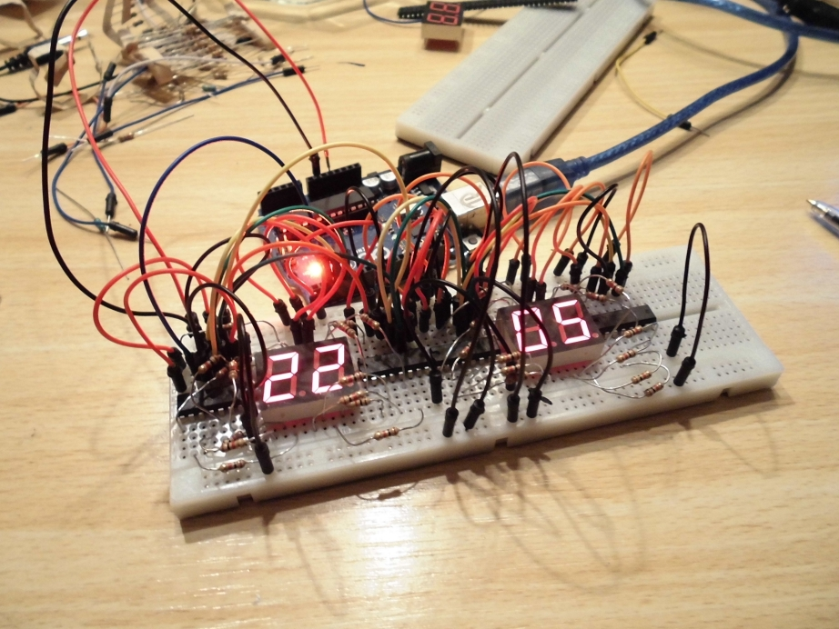
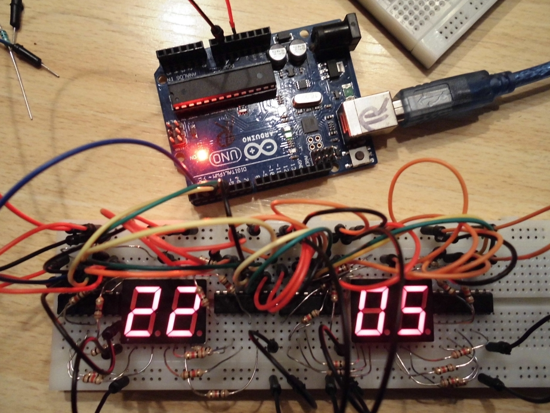
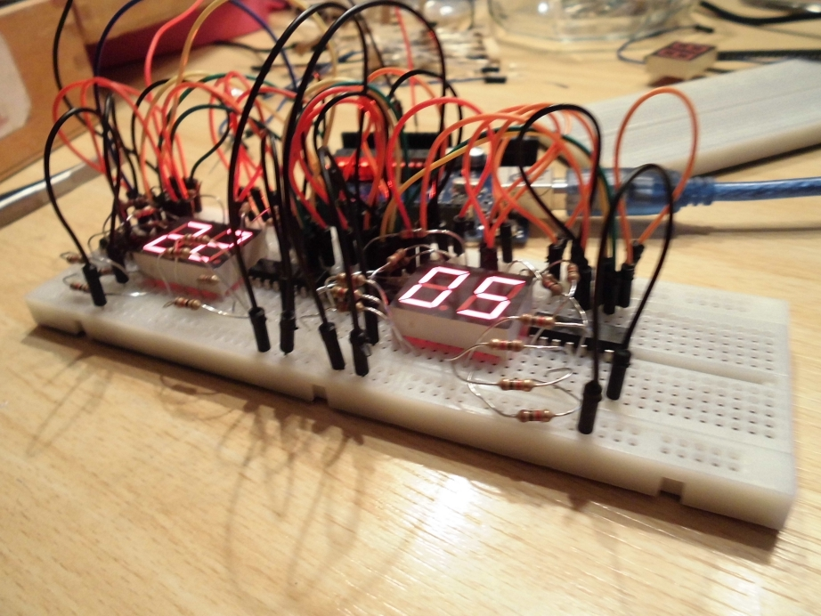

# MoreOrLessClock

The MoreOrLessClock is a clock that displays more or less the correct time.

You can download all files here, or view the [FAQ](FAQ.md).

Downloads:
 * [Arduino code](MoreOrLessClock/MoreOrLessClock.ino)
 

